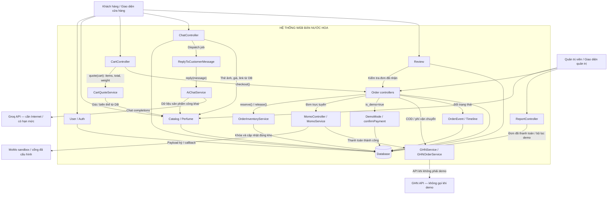

# Thiết kế thành phần — Web bán nước hoa Hạ Thu

Tài liệu mô tả mã nguồn hiện tại; không coi phần mô phỏng là tích hợp thanh toán/giao hàng thật.

## 1. Thành phần cốt lõi và ý nghĩa

- Catalog: PerfumeController, Admin/ProductController và Perfume/Product cùng dùng bảng perfumes. Quản lý thông tin, ảnh, giá và tồn kho theo dung tích.
- User/Auth: đăng nhập, phân quyền admin/user/livestream_staff; xác thực email. Demo thư xác thực chỉ hoạt động local và mail log.
- Cart: CartController lưu lựa chọn vào session; CartQuoteService tính giá từ cơ sở dữ liệu.
- Order: hai controller khách hàng/quản trị quản lý đơn và kiểm tra quyền sở hữu. Order ghi OrderEvent khi tạo hoặc đổi trạng thái.
- Inventory: OrderInventoryService là nơi dùng chung để trừ/hoàn kho theo từng dung tích; khóa dữ liệu trong transaction.
- Payment: MomoController/MomoService xử lý cổng thật/sandbox với chữ ký. Thanh toán mô phỏng là nhánh riêng cho đơn is_demo.
- Shipping: GHNService lấy địa chỉ/phí; GHNOrderService tạo vận đơn. Đơn demo dùng địa chỉ mẫu, phí 30.000đ và mã DEMO-{id}, không tạo vận đơn thật.
- Chat: ChatController lưu tin; ReplyToCustomerMessage chạy hàng đợi; AiChatService gọi Groq. Người dùng có thể chọn nhân viên.
- Review: StoreExperienceController::review yêu cầu có đơn đã nhận của đúng khách và sản phẩm.
- Report: ReportController tổng hợp đơn đã thu tiền, tách demo/thực và xuất CSV.
- Persistence: Eloquent và SQLite cho demo (dự án cũng có cấu hình MySQL). Không có tầng Repository riêng trong phiên bản này.

## 2. Dependency và ý nghĩa

Mũi tên A → B nghĩa là A dùng hàm hoặc dữ liệu của B, không phải chiều dữ liệu trả về.

- CartController → CartQuoteService → Perfume: lấy giá hiện tại, kiểm tra biến thể, bỏ qua giá cũ trong session.
- CartController / UserOrderController → OrderInventoryService → Order/OrderItem/Perfume: đặt hàng chỉ hoàn tất khi đủ tổng tồn kho; lỗi bất kỳ dòng nào làm rollback.
- AdminOrderController / UserOrderController → OrderInventoryService::release: hủy chỉ hoàn kho đã được hệ thống ghi nhận trừ, không cộng lặp.
- Payment → Order và PaymentTransaction: kiểm tra chủ đơn, số tiền, trạng thái; không thanh toán lại đơn kết thúc. Callback đến sau hủy chuyển giao dịch sang chờ hoàn tiền, không mở lại đơn.
- Order → OrderEvent: ghi trạng thái trước/sau và thời điểm; giao diện khách/admin cùng đọc một lịch sử.
- Chat → Queue → Groq: không giữ khóa DB trong lúc chờ mạng; chỉ gửi nội dung hội thoại liên quan và dữ liệu sản phẩm công khai, không gửi toàn bộ hồ sơ khách.
- Chat → Perfume: thẻ sản phẩm khớp tên đầy đủ được nhắc trong câu trả lời; ảnh/giá/link lấy từ DB, không dùng link AI tự viết.
- Report → Order/PaymentTransaction: tính mỗi đơn một lần và xuất cùng bộ lọc.
- Review → OrderItem/Order: xác minh đã mua và nhận hàng trước khi lưu đánh giá.

## 3. Interface: hàm gọi và kết quả

Interface trong bài là hợp đồng hàm cung cấp, không phải giao diện màn hình và không nhất thiết là từ khóa interface của PHP.

| Hàm cung cấp | Đầu vào | Kết quả / tác dụng |
|---|---|---|
| CartQuoteService::unitPrice(product, volume, gift) | Sản phẩm, ml, gói quà | Giá nguyên VND; lỗi validation nếu dung tích không hợp lệ |
| CartQuoteService::quote(cart) | Các dòng session | items, total, weight; tính lại giá và thành phần Discovery Box |
| OrderInventoryService::reserve(order) | Đơn unreserved và các dòng đã lưu | Trừ đúng kho, chuyển reserved; không trừ lần hai |
| OrderInventoryService::release(order) | Đơn reserved | Hoàn đúng kho, chuyển released; không hoàn lần hai |
| UserOrderController::processPayment(request, ghn, shipping) | Địa chỉ, phương thức, coupon/điểm | Tạo đơn, kiểm tra kho; chuyển sang demo/MoMo/COD |
| UserOrderController::confirmPayment(order, request, shipping) | scenario success/declined/insufficient/limit | Chỉ mô phỏng đơn demo local; không thu tiền |
| MomoController::ipn(request, shipping, momo) | Payload có chữ ký của cổng | Xác nhận giao dịch hợp lệ; callback hủy không mở lại đơn |
| GHNService::calculateFee(params) | Địa chỉ, khối lượng | code và data.total; demo là phí cố định |
| UserChatController::send(request, ai) | message tối đa 1.000 ký tự | Lưu Message, xếp job, trả JSON |
| AiChatService::reply(message) | Tin nhắn và lịch sử liên quan | Chuỗi trả lời; lỗi mạng/quota được job xử lý, không mất tin khách |
| UserChatController::getMessages() | Người đăng nhập | Tối đa 100 tin và thẻ sản phẩm công khai |
| ReportController::export(request) | Ngày/danh mục/cổng/mode | CSV UTF-8; chỉ admin được tải |

## 4. Bảng tổng hợp theo mẫu bài tập

| Component | Trách nhiệm | Interface (hàm cung cấp) | Dependency (cần dùng tới) | Giải thích liên kết |
|---|---|---|---|---|
| Catalog | Nước hoa, ảnh, giá, dung tích | index(), show(), store(), update() | Perfume, Category, DB | Khách chỉ đọc; quản trị được ghi |
| Cart | Lựa chọn mua hàng | add(), update(), checkout() | Catalog, CartQuote, Inventory, Order | Giá chốt từ DB, kho trừ theo biến thể |
| CartQuote | Một quy tắc tính giá | quote(), unitPrice() | Perfume | Dùng chung giỏ hàng, thanh toán, AI |
| Inventory | Trừ/hoàn kho | reserve(), release() | Order, OrderItem, Perfume | Gộp các dòng cùng biến thể trước khi kiểm tra |
| Order | Vòng đời đơn | processPayment(), cancel(), update(), bulkUpdate() | User, CartQuote, Inventory, Payment, Shipping | Kiểm tra quyền, trạng thái và tính nhất quán |
| Payment | Giao dịch thật/sandbox hoặc demo | start(), ipn(), confirmPayment() | Order, PaymentTransaction, MoMo | Demo và callback có xác thực là hai luồng khác nhau |
| Shipping | Địa chỉ, cước, vận đơn | calculateFee(), create(), cancelOrder() | Order, GHN | Demo không cần tài khoản GHN |
| Chat | Tư vấn và chuyển nhân viên | send(), getMessages(), mode(), reply() | User, Message, Queue, Catalog, Groq | Hết quota vẫn lưu tin, cho phép nhân viên trả lời |
| Review | Nhận xét sau mua | review() | User, Order, OrderItem, PerfumeReview | Chỉ khách đã nhận sản phẩm được đánh giá |
| Report | Thống kê/xuất dữ liệu | index(), charts(), export() | Order, PaymentTransaction, Category | Tách đơn demo; tổng thu không đồng nghĩa lợi nhuận |
| Audit | Lịch sử đơn | Order::events() | OrderEvent, DB | Hiển thị cùng lịch sử cho khách và admin |

## 5. Sơ đồ thành phần tổng thể (một sơ đồ)

## Kịch bản trình bày 7–10 phút

1. Mở trang chủ, lọc/chọn một nước hoa. Giải thích từng dung tích có kho riêng, giá được tính trên server.
2. Thêm chai 10ml và gói quà; thử mua quá tồn để cho thấy thông báo lỗi.
3. Đặt đơn demo, chọn thành công/thất bại; nhấn lại xác nhận để chứng minh không tạo hai giao dịch đã trả.
4. Mở chi tiết đơn để xem timeline. Hủy đơn chưa giao; kiểm tra kho hoàn đúng một lần.
5. Chat hỏi một tên sản phẩm cụ thể có trong catalog; mở thẻ sản phẩm. Chọn “Gặp nhân viên” để trình bày cơ chế dự phòng.
6. Đăng nhập admin trong trình duyệt riêng; xem đơn, sửa kho mẫu 5ml nếu muốn demo Discovery Box, lọc báo cáo “Chỉ đơn demo”, tải CSV.
7. Trình bày sơ đồ trên và chạy PHPUnit: không gọi API thật, dùng SQLite in-memory.
8. Nêu giới hạn một cách trung thực: quota AI, mô phỏng giao hàng/thanh toán, không có tính năng hoàn tiền tự động.

## Những giới hạn cần nói rõ

- Đơn lịch sử trước nâng cấp có inventory_status=legacy. Không tự đoán đã trừ kho hay chưa, không tự cộng kho khi hủy.
- Kho 5ml mặc định 0; phải nhập kho trước khi mua Discovery Box. Kho 10/50ml null không còn tự sinh từ chai lớn.
- Hủy đơn đã trả tiền đánh dấu refund_pending; hoàn tiền qua ngân hàng/cổng cần quy trình riêng, chưa được tự động thực hiện.
- GHN webhook mặc định chặn. Nếu triển khai thật phải có relay xác thực nguồn và gắn X-Webhook-Token khớp GHN_WEBHOOK_TOKEN; đây là hợp đồng của ứng dụng, không phải tuyên bố GHN tự gửi header này.
- Đặt lại sau hủy phải tạo đơn mới; không “khôi phục” đơn terminal.
- Mã/khóa API trong .env của từng máy; không đóng gói khóa với Git. Không thể bảo đảm Groq miễn phí vô hạn hay luôn sẵn sàng.
- Tồn kho/transaction được kiểm thử tuần tự với SQLite; cần thêm load test trên MySQL và đối soát cổng trước khi dùng thương mại.
